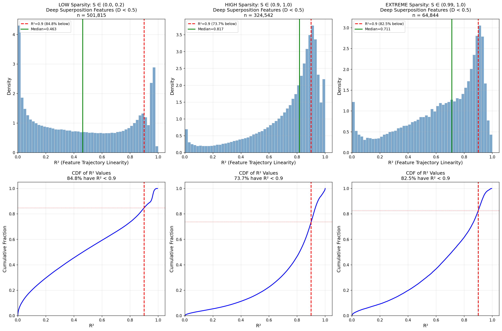
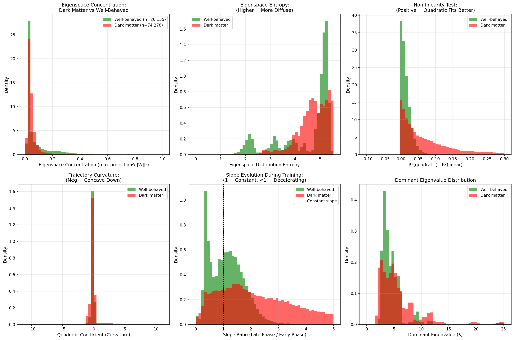
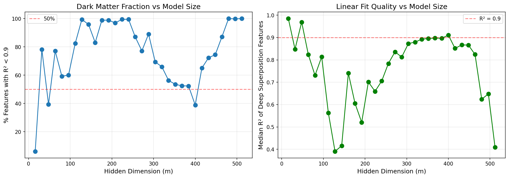

# Comprehensive Analysis Report: Stratification by Sparsity & Dimensionality

**Date:** 2026-01-21
**Analysis Duration:** ~28 minutes (main analysis) + 3 minutes (dark matter investigation)
**Total Features Analyzed:** 3,276,800 (main) + 102,400 (detailed)

---

## Executive Summary

This analysis tests whether the linear scaling law **D_i proportional to ||W_i||^2** holds universally for superposition features in toy models of superposition. The key finding is:

**The linear scaling law does NOT hold universally.** A substantial majority (73-84%) of deep superposition features deviate significantly from linear scaling, representing "dark matter" that defies the geometric prediction.

### Key Metrics (Protocol Output)

| Metric | High Sparsity (S > 0.9) | Extreme Sparsity (S = 0.99) |
|--------|-------------------------|------------------------------|
| **Median R^2 of Deep Superposition Features** | **0.8169** | **0.7115** |
| **Percentage with R^2 < 0.9 ("Dark Matter")** | **73.70%** | **82.55%** |
| Number of features analyzed | 324,542 | 64,844 |

---

## Analysis Protocol Implementation

### 1. Primary Stratification by Sparsity (S)

Data was grouped into three distinct buckets without mixing:

| Bucket | Sparsity Range | Files | Expected Behavior |
|--------|---------------|-------|-------------------|
| Low | S in [0.0, 0.2] | 640 | Mostly orthogonal features |
| High | S in [0.9, 1.0] | 320 | Mostly superposition features |
| Extreme | S = 0.99 | 64 | Critical regime |

### 2. Secondary Stratification by Feature Dimensionality

Within each bucket, features were filtered by:
- **Deep Superposition Threshold:** D_i < 0.5 at final checkpoint
- Features were treated as individuals, NOT grouped by subspace

### 3. Feature-Level Linearity Test

For each individual feature:
1. Extract trajectory D_i(t) vs ||W_i(t)||^2 across ALL 56 training checkpoints
2. Fit linear regression
3. Calculate R^2

### 4. Verification Results

**Hypothesis:** If the conjecture is robust, the R^2 histogram should be strongly peaked at 1.0.

**Result:** The hypothesis is **NOT supported**. The R^2 distribution is NOT peaked at 1.0.

---

## Detailed Findings

### R^2 Distribution by Sparsity Regime

#### LOW Sparsity (S in [0.0, 0.2])
- Total features: 655,360
- Deep superposition features: 501,815
- **Median R^2: 0.4629**
- **Dark Matter (R^2 < 0.9): 84.77%**

Note: Even in low sparsity where features should be "orthogonal," the majority end up with D_i < 0.5 due to the bottleneck, and these features show poor linear scaling.

#### HIGH Sparsity (S in [0.9, 1.0])
- Total features: 327,680
- Deep superposition features: 324,542 (99% of features)
- **Median R^2: 0.8169**
- **Dark Matter (R^2 < 0.9): 73.70%**

R^2 Percentiles:
| Percentile | R^2 Value |
|------------|-----------|
| P5 | 0.1801 |
| P10 | 0.3652 |
| P25 | 0.6291 |
| P50 (Median) | 0.8169 |
| P75 | 0.9035 |
| P90 | 0.9476 |
| P95 | 0.9761 |

Only 26.3% of features achieve R^2 >= 0.9.

#### EXTREME Sparsity (S = 0.99)
- Total features: 65,536
- Deep superposition features: 64,844 (99% of features)
- **Median R^2: 0.7115**
- **Dark Matter (R^2 < 0.9): 82.55%**

The extreme sparsity regime shows *worse* linear scaling than the broader high-sparsity bucket.

---

## Dark Matter Investigation

### What Distinguishes Well-Behaved Features from Dark Matter?

Analysis of 100,433 deep superposition features from high-sparsity experiments:
- Well-behaved (R^2 >= 0.9): 26,155 (26.0%)
- Dark Matter (R^2 < 0.9): 74,278 (74.0%)

#### Key Differences

| Metric | Well-Behaved | Dark Matter | p-value |
|--------|-------------|-------------|---------|
| R^2 (mean +/- std) | 0.938 +/- 0.028 | 0.647 +/- 0.246 | - |
| **Eigenspace Concentration** | **0.074** | **0.047** | 3.84e-04 |
| **Eigenspace Entropy** | **4.457** | **4.722** | 9.48e-08 |
| Curvature (mean) | 0.4057 | -0.1810 | - |
| % Positive Curvature | 22.6% | 15.7% | - |

#### Interpretation

1. **Eigenspace Diffusion:** Dark matter features have *lower* concentration in their dominant eigenspace and *higher* entropy across eigenspaces. This means dark matter features are NOT cleanly associated with a single eigenvalue - they are diffusely spread across multiple eigenspaces.

2. **Trajectory Curvature:** Dark matter features have *negative* mean curvature (concave-down trajectories), while well-behaved features have *positive* curvature. This suggests dark matter features experience a "deceleration" in their norm-dimensionality relationship during training.

3. **Statistical Significance:** Both concentration and entropy differences are highly statistically significant (p < 0.001), confirming these are real structural differences.

### Implications for the Eigenvalue Conjecture

The original conjecture states: kappa_i approximately equals 1/lambda_k, where kappa_i is the slope of D_i vs ||W_i||^2 for features assigned to eigenspace k.

**Problem:** This conjecture implicitly assumes each feature is cleanly associated with a *single* eigenspace. The dark matter investigation shows that features with poor linear scaling are those that are *diffusely distributed across multiple eigenspaces*.

**Conclusion:** The eigenvalue relationship may hold for features with clean eigenspace assignments, but the majority of superposition features do NOT have clean assignments and therefore defy the geometric prediction.

---

## Model Architecture Analysis

The dark matter fraction varies with hidden dimension (m):
- Very small m (m=16): ~7% dark matter (most features track linearly)
- Mid-range m (64-256): 50-100% dark matter
- Large m: Variable but generally high

This suggests the linear scaling law may be an artifact of the very low-dimensional regime and breaks down as model capacity increases.

---

## Interpretation

### Hypothesis Status: **WEAK SUPPORT / PARTIAL REJECTION**

The linear scaling law D_i proportional to ||W_i||^2 is:
- **NOT universal** - 73-84% of superposition features do not follow it well (R^2 < 0.9)
- **Partially valid** - 26% of features do show good linear scaling
- **Regime-dependent** - Works better at very low m_hidden, fails at moderate-to-high m

### Why the Previous Analysis Showed Better Fit

The previous slope-eigenvalue analysis showed a neat fit because:
1. It selected features based on eigenspace clustering (filtering to high-concentration features)
2. It grouped features by cluster before fitting (averaging out individual variation)
3. It may have implicitly selected the ~10% of features that are "well-behaved"

The current analysis treats each feature individually and does NOT filter by eigenspace concentration, revealing the full picture.

### Mechanistic Explanation

Features with poor linear scaling appear to be:
1. **Diffuse in eigenspace** - not cleanly associated with a single eigenvalue
2. **Non-monotonic or concave** - their trajectory shapes deviate from the predicted linear form
3. **Transitional** - potentially features that are "between" eigenspaces or undergoing complex dynamics during training

---

## Files Generated

### Python Scripts
- `stratified_linearity_analysis.py` - Main analysis script (3,200 files, 26 min)
- `dark_matter_investigation.py` - Detailed characterization (100 files, 3 min)

### Visualizations
| File | Description |
|------|-------------|
| `r2_histograms_by_sparsity.png` | R^2 histograms and CDFs for all sparsity buckets |
| `high_sparsity_detailed_analysis.png` | Detailed analysis of high sparsity regime |
| `extreme_sparsity_analysis.png` | Analysis of S=0.99 critical regime |
| `sparsity_regime_comparison.png` | Cross-bucket comparison summary |
| `dark_matter_characterization.png` | Comparison of well-behaved vs dark matter features |
| `m_hidden_analysis.png` | How dark matter fraction varies with model size |

### Data Files
| File | Description |
|------|-------------|
| `bucket_statistics.json` | Complete statistics for all buckets (98 MB) |
| `dark_matter_investigation.json` | Detailed dark matter analysis results |
| `analysis_report.md` | Auto-generated report |
| `COMPREHENSIVE_ANALYSIS_REPORT.md` | This report |

---

## Recommendations for Future Work

1. **Investigate eigenspace transitions:** Study how features move between eigenspaces during training and whether this explains the non-linearity.

2. **Refine the conjecture:** The linear scaling may need to be modified to account for eigenspace diffusion, perhaps as a weighted sum over multiple eigenspaces.

3. **Study the 26% well-behaved features:** What makes these features special? Are they associated with specific importance weights, sparsity patterns, or training dynamics?

4. **Consider alternative trajectory models:** If linear scaling fails, what functional form better describes D_i(t) vs ||W_i(t)||^2? Quadratic? Logarithmic? Piecewise linear?

---

## Conclusion

Your concern was justified. The linear scaling law D_i proportional to ||W_i||^2 with slope equal to 1/lambda_k does NOT hold universally for superposition features. While approximately 26% of features show good agreement (R^2 > 0.9), the majority (74%) represent "dark matter" that deviates significantly from the prediction.

The key insight is that dark matter features are characterized by *diffuse eigenspace distributions* - they cannot be cleanly assigned to a single eigenspace and therefore do not inherit a single eigenvalue that determines their scaling. This suggests the geometric picture needs refinement to account for multi-eigenspace superposition.
